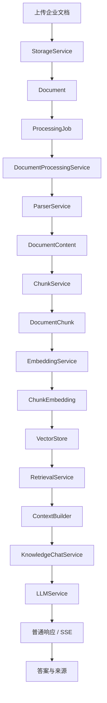

# AI 知识库办公助手（Knowledge Assistant）

> 一个面向企业私有知识的后端 RAG MVP：从文档上传、解析、切片、向量化、检索，到受控问答、来源追溯、SSE 和异步处理任务，完整走通知识库问答链路。

当前版本：`v0.9.0`  
当前阶段：可演示、可验证、可用于面试展示的单机后端版本

## 项目定位

Knowledge Assistant 用于帮助企业快速搭建私有知识问答助手，让内部文档、产品手册、流程规范、API 文档和技术资料可以被检索、问答和追溯来源。

项目重点不是通用聊天或通用写作，而是：

- 企业私有文档加工
- 企业知识检索
- 基于知识库的受控问答
- 新员工资料查询
- 内部流程、规范和 API 文档查询
- 回答来源追溯
- 文档处理任务状态与失败重试

## 当前能力

### 文档生命周期

- 文档上传、列表、详情和删除
- 本地文件存储
- SQLite 元数据持久化
- Alembic 数据库迁移
- SQLite 外键约束与级联清理
- 文档状态流转

### 文档解析

- TXT 文档解析
- PDF 文本层提取
- PDF 乱码和异常文本检测
- 扫描件或异常 PDF 的 OCR 降级
- 中文与英文 OCR
- 空白页跳过
- 全文为空时失败

### RAG 链路

- Recursive Character Chunk
- Embedding 生成与持久化
- SQL 向量存储
- Dense Retrieval
- 候选扩召回
- 相似度阈值过滤
- 结果去重
- 多文档结果平衡
- ContextBuilder
- 无上下文时直接拒答
- 普通知识库问答
- SSE 流式问答
- 回答来源与真实文件名追溯

### ProcessingJob

支持以下任务类型：

- `document_processing`
- `embedding`
- `full_pipeline`

支持以下任务状态：

- `pending`
- `running`
- `succeeded`
- `failed`

当前已实现：

- 创建处理任务
- 查询任务详情、最新任务和历史任务
- 同一文档仅允许一个活动任务
- 失败后重新创建任务
- 任务进度记录
- 失败原因保存
- 完整流水线处理

当前任务调度基于 FastAPI `BackgroundTasks`，后续将迁移到独立 Worker。

## 系统架构



### 知识库问答链路

```text
POST /knowledge/chat
或 POST /knowledge/chat/stream
  ↓
KnowledgeChatService.prepare
  ↓
RetrievalService.retrieve
  ↓
EmbeddingProvider.embed_query
  ↓
VectorStore.search
  ↓
阈值过滤、去重和多文档平衡
  ↓
ContextBuilder
  ↓
构造 Prompt 与公开 Sources
  ↓
无有效上下文：直接拒答
有有效上下文：调用 LLM 生成回答
```

### 当前数据关系

```text
Document
  ├─ DocumentContent
  │    └─ DocumentChunk
  │         └─ ChunkEmbedding
  └─ ProcessingJob
```

关系数据使用数据库外键和 `ON DELETE CASCADE` 保证删除一致性。SQLite 连接会统一开启 `PRAGMA foreign_keys=ON`。

## 技术栈

- Python 3.11
- FastAPI
- Uvicorn
- Pydantic Settings
- SQLAlchemy
- Alembic
- SQLite
- OpenAI Compatible SDK
- PyMuPDF
- Tesseract OCR
- pytest

## 项目结构

```text
.
├─ alembic/                   # 数据库迁移
├─ app/
│  ├─ api/                    # FastAPI Router
│  ├─ constants/              # 状态与任务类型常量
│  ├─ core/                   # 配置与数据库连接
│  ├─ models/database/        # SQLAlchemy 数据模型
│  ├─ repositories/           # 数据访问层
│  ├─ schemas/                # 请求与响应模型
│  └─ services/
│     ├─ chunking/            # Chunk 策略
│     ├─ embedding/           # Embedding Provider
│     ├─ evaluation/          # 检索评估
│     ├─ rag/                 # ContextBuilder
│     └─ vector_store/        # VectorStore 抽象与 SQL 实现
├─ evaluation/                # 评估集与评估报告
├─ scripts/                   # 评估和验收脚本
├─ tests/                     # 自动化测试
├─ uploads/                   # 本地上传文件
├─ .env.example
├─ alembic.ini
├─ pytest.ini
└─ requirements.txt
```

## 环境准备

### 1. 创建并激活环境

```powershell
conda create -n Knowledge-Assistant python=3.11
conda activate Knowledge-Assistant
```

### 2. 安装依赖

```powershell
pip install -r requirements.txt
```

### 3. 配置环境变量

复制配置模板：

```powershell
Copy-Item .env.example .env
```

根据实际模型服务填写 `.env`：

```dotenv
APP_NAME=Knowledge Assistant
DEBUG=false

MODEL_PROVIDER=
MODEL_BASE_URL=
MODEL_NAME=
MODEL_API_KEY=

EMBEDDING_PROVIDER=
EMBEDDING_BASE_URL=
EMBEDDING_MODEL=
EMBEDDING_API_KEY=
EMBEDDING_DIMENSION=1024

CHUNK_STRATEGY=recursive_character
CHUNK_SIZE=600
CHUNK_OVERLAP=100

RETRIEVAL_TOP_K=5
RETRIEVAL_CANDIDATE_K=20
RETRIEVAL_SCORE_THRESHOLD=-1.0
KNOWLEDGE_CHAT_SCORE_THRESHOLD=0.50
RETRIEVAL_PER_DOCUMENT_LIMIT=2

DATABASE_URL=sqlite:///./knowledge_assistant.db
TEST_DATABASE_URL=sqlite:///./test.db
```

模型和 Embedding 服务需要兼容项目当前 Provider 实现。不要将真实 API Key 提交到 Git。

### 4. 安装 Tesseract OCR

PDF OCR 需要本机安装 Tesseract，并具备以下语言数据：

```text
eng.traineddata
chi_sim.traineddata
```

当前 OCR 语言配置为：

```text
chi_sim+eng
```

确保 Tesseract 可执行文件和 `TESSDATA_PREFIX` 已正确配置。纯 TXT 或带正常文本层的 PDF 不依赖 OCR。

## 初始化数据库

项目使用 Alembic 管理数据库结构，不依赖长期运行 `Base.metadata.create_all()`。

```powershell
alembic upgrade head
```

查看当前版本：

```powershell
alembic current
```

创建新迁移时：

```powershell
alembic revision --autogenerate -m "迁移说明"
alembic upgrade head
```

## 启动服务

```powershell
uvicorn app.main:app --reload
```

启动后访问：

- Swagger UI：`http://127.0.0.1:8000/docs`
- OpenAPI JSON：`http://127.0.0.1:8000/openapi.json`

## 核心 API

### 文档

| Method | Path | 说明 |
|---|---|---|
| `POST` | `/documents/` | 上传文档 |
| `GET` | `/documents/` | 查询文档列表 |
| `GET` | `/documents/{document_id}` | 查询文档详情 |
| `DELETE` | `/documents/{document_id}` | 删除文档及关联知识数据 |
| `GET` | `/documents/{document_id}/content` | 查询解析全文 |
| `GET` | `/documents/{document_id}/chunks` | 查询 Chunk |
| `GET` | `/documents/{document_id}/chunk-summary` | 查询 Chunk 摘要 |

### 处理任务

| Method | Path | 说明 |
|---|---|---|
| `POST` | `/documents/{document_id}/processing-jobs` | 创建处理任务 |
| `GET` | `/processing-jobs/{job_id}` | 查询任务详情 |
| `GET` | `/documents/{document_id}/processing-jobs` | 查询任务历史 |
| `GET` | `/documents/{document_id}/processing-jobs/latest` | 查询最新任务 |

创建完整流水线任务：

```json
{
  "job_type": "full_pipeline"
}
```

### 检索与问答

| Method | Path | 说明 |
|---|---|---|
| `POST` | `/knowledge/retrieval/debug` | 检索调试 |
| `POST` | `/knowledge/chat` | 知识库问答 |
| `POST` | `/knowledge/chat/stream` | SSE 知识库问答 |

问答请求示例：

```json
{
  "question": "系统发生故障时应该执行哪些恢复步骤？",
  "document_id": 1,
  "top_k": 5
}
```

响应包含回答和公开来源：

```json
{
  "answer": "根据知识库内容……",
  "sources": [
    {
      "source_number": 1,
      "document_id": 1,
      "filename": "故障恢复手册.txt",
      "excerpt": "……"
    }
  ]
}
```

当检索不到足够可靠的知识时，服务会返回知识不足提示，而不是要求 LLM 猜测答案。

## 测试

运行全量测试：

```powershell
pytest -v
```

`v0.9.0` 验收结果：

```text
157 passed
1 skipped
1 warning
```

当前 warning 来自 Starlette `TestClient` 与 `httpx` 的兼容性弃用提示，不影响本版本业务验收，后续将随依赖升级处理。

测试数据库由 `tests/conftest.py` 独立创建，通过 Alembic 初始化，并在测试结束后清理，避免污染正式数据库。

## 检索评估

项目包含检索评估框架和示例评估集：

```text
evaluation/retrieval_cases.json
evaluation/reports/
scripts/run_retrieval_evaluation.py
```

运行评估：

```powershell
python -m scripts.run_retrieval_evaluation
```

当前可用于比较 Baseline 和 Optimized 检索策略。后续将扩展 Recall@K、MRR、nDCG、无答案误召回率、重复率、文档覆盖和 P95 延迟等指标。

## 演示流程

推荐使用固定知识文档完成以下演示：

1. 上传 TXT 或 PDF。
2. 创建 `full_pipeline` ProcessingJob。
3. 查询 Job，确认 `status=succeeded`、`progress=100`。
4. 查看解析全文和 Chunk。
5. 提问文档中有明确答案的问题。
6. 检查回答来源中的真实文件名。
7. 提问文档中不存在的信息，验证系统拒绝编造。
8. 使用 SSE 接口验证 `metadata → message → done`。
9. 删除文档，验证内容、Chunk、Embedding 和 ProcessingJob 级联清理。

## 已知限制

当前版本定位为单机后端 MVP，尚未完成：

- Qdrant 专用向量数据库
- BM25、Hybrid Retrieval 和 RRF
- Cross-Encoder Reranker
- Parent-Child Chunk
- 独立 Worker、任务超时和恢复
- PostgreSQL、Redis、Celery
- MinIO 或对象存储
- Docker Compose
- 完整前端
- 多租户、认证和复杂权限
- 生产级日志、监控、限流和安全防护

不要将当前版本描述为已经完成大规模、高并发、生产级企业交付。

## 路线图

| 版本 | 目标 |
|---|---|
| `v0.9.0` | 后端 RAG MVP、稳定演示、测试和发布材料 |
| `v0.10.0` | Qdrant、Upsert/Delete、过滤和索引重建 |
| `v0.11.0` | 企业检索评估、BM25、RRF、Reranker |
| `v0.12.0` | Parent-Child、Markdown、HTML 和结构化文档 |
| `v0.13.0` | PostgreSQL、Celery、Redis、Docker Compose、MinIO |
| `v1.0.0` | 可部署、可评估、可恢复、可观测的单租户 RAG 系统 |

## 设计原则

- Router 负责 HTTP 协议和参数边界
- Service 负责业务编排和事务边界
- Repository 只负责数据读写和 `flush`，不自行 `commit`
- 数据库外键负责关系数据完整性
- Storage、Embedding 和 VectorStore 通过抽象隔离实现
- 无可靠上下文时拒答，避免模型脱离知识库编造
- 优先保留有工程价值、可解释、可测试的实现
- MVP-first，非阻塞优化进入后续路线图

## License

当前项目为个人学习、求职展示和架构实践项目。正式开源前请补充明确的 License。
