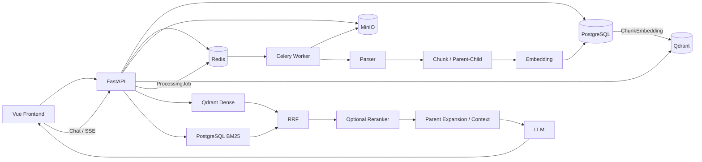

# Knowledge Assistant

> 面向企业私有知识的 RAG 知识助手：文档上传 → 异步解析/切片/向量化 → Hybrid Retrieval → 知识问答/SSE → 来源追溯，并提供用户隔离、MinIO 对象存储、Qdrant 索引和恢复能力。

**状态：v1.0 Release Candidate。** 核心前后端与 Fresh-machine E2E 已完成验收；正式 `v1.0.0` 发布前建议完成最终回归与发布配置收口。

## 能力概览

| 模块 | 当前实现 |
|---|---|
| Auth / RBAC | 注册、登录、Argon2、JWT、`user/admin`、KnowledgeBase Owner 隔离、越权资源 404 隐藏 |
| KnowledgeBase | 创建、列表、详情、修改、删除 |
| Document | PDF / TXT / Markdown / HTML；默认 20 MiB；安全文件名/MIME/内容校验 |
| Parser | PyMuPDF、PDF 质量检测、OCR 降级、中英 OCR、Markdown/HTML 章节、代码块/表格候选 |
| Chunk | Recursive Character、Structure-aware Parent、Parent-Child |
| ProcessingJob | Redis + Celery；解析、切片、Embedding、Index；重试、租约、恢复、幂等 |
| Retrieval | Qdrant Dense + PostgreSQL BM25 + RRF；可选 Bailian Reranker；Parent 回扩与结果平衡 |
| RAG | 受控问答、无可靠上下文拒答、普通响应、SSE、Source Citation |
| Storage | Local / MinIO；Docker 默认 MinIO；支持 Local → MinIO 迁移 |
| Recovery | PostgreSQL Backup/Restore；Qdrant 可从 SQL `ChunkEmbedding` 全量/单文档重建 |
| Observability | `X-Request-ID`、请求/检索阶段/LLM 耗时日志 |
| Frontend | Vue 3 + Vite + TypeScript；Auth、KB、Document、Job、Chat、SSE、Source、主题/响应式 |

## 架构



```text
PostgreSQL = 业务与向量事实来源
MinIO      = 原始文档对象存储
Qdrant     = 可重建检索索引
Redis      = Celery Broker / Result Backend
Celery     = 异步处理执行器
```

## 技术栈

Backend：Python 3.11、FastAPI、SQLAlchemy、Alembic、PostgreSQL/SQLite、Redis/Celery、Qdrant、MinIO、OpenAI-Compatible SDK、PyMuPDF/Tesseract、Argon2/PyJWT、pytest。  
Frontend：Vue 3、Vite、TypeScript、Axios、lucide-vue-next。

---

# 快速使用（推荐）

推荐：**Backend 用 Docker Compose，Frontend 用 Vite Dev Server**。

### 1. 准备

需要 Docker + Docker Compose、Node.js + npm、可用的 LLM API 与 Embedding API。

### 2. 获取项目

```powershell
git clone <repository-url>
cd Knowledge-Assistant
```

### 3. 配置 Backend

```powershell
cd backend
Copy-Item .env.example .env
```

编辑 `.env`，至少替换：

```dotenv
MODEL_PROVIDER=<provider-name>
MODEL_NAME=<llm-model>
MODEL_BASE_URL=<openai-compatible-base-url>
MODEL_API_KEY=<your-api-key>

EMBEDDING_PROVIDER=<volcengine-or-bailian>
EMBEDDING_BASE_URL=<embedding-base-url>
EMBEDDING_MODEL=<embedding-model>
EMBEDDING_API_KEY=<your-api-key>
EMBEDDING_DIMENSION=<actual-vector-dimension>

JWT_SECRET_KEY=<random-secret-at-least-32-chars>
```

Docker v1.0 推荐保持：

```dotenv
VECTOR_STORE_BACKEND=qdrant
DOCKER_STORAGE_BACKEND=minio

CHUNK_STRATEGY=recursive_character
CHUNK_SIZE=600
CHUNK_OVERLAP=100
STRUCTURE_AWARE_PARENT_ENABLED=True
PARENT_CHILD_ENABLED=True
PARENT_CHILD_CHILD_SIZE=300
PARENT_CHILD_CHILD_OVERLAP=50

RETRIEVAL_TOP_K=5
RETRIEVAL_CANDIDATE_K=20
RETRIEVAL_SCORE_THRESHOLD=-1.0
RETRIEVAL_PER_DOCUMENT_LIMIT=2
RETRIEVAL_HYBRID_ENABLED=True
RETRIEVAL_RRF_K=60
KNOWLEDGE_CHAT_SCORE_THRESHOLD=0.40
```

> `EMBEDDING_DIMENSION` 必须与真实 Embedding 模型输出维度一致。不要提交 `.env` 或真实 API Key。

随机 JWT Secret 可用：

```powershell
python -c "import secrets; print(secrets.token_urlsafe(48))"
```

### 4. 启动 Backend

```powershell
docker compose up -d --build
docker compose ps
```

正常应看到 `postgres/redis` healthy，`qdrant/minio/worker` up，`api` healthy。

地址：

```text
API / Swagger     http://127.0.0.1:8000 / http://127.0.0.1:8000/docs
MinIO Console     http://127.0.0.1:9001
Qdrant Dashboard  http://127.0.0.1:6333/dashboard
```

API 容器启动时自动执行：

```text
alembic upgrade head
→ uvicorn app.main:app
```

### 5. 启动 Frontend

新开 PowerShell：

```powershell
cd frontend
npm install
npm run dev
```

打开：

```text
http://127.0.0.1:5173
```

### 6. 产品使用流程

```text
注册
→ 登录
→ 创建 KnowledgeBase
→ 上传 PDF/TXT/MD/HTML
→ 自动创建 full_pipeline ProcessingJob
→ 等待任务完成
→ 进入 Chat
→ 选择 KnowledgeBase（可限制到 Document）
→ 提问
→ 查看 Answer + Source Citation
```

处理链：

```text
Upload → MinIO → Parse → Chunk → Embedding
→ PostgreSQL ChunkEmbedding → Qdrant Index → COMPLETED
```

---

# 常用命令

Backend：

```powershell
cd backend
docker compose ps
docker compose logs --tail 100 api
docker compose logs --tail 100 worker
docker compose down          # 保留数据卷
docker compose up -d         # 再启动
```

只有确定要删除 PostgreSQL / Redis / Qdrant / MinIO 数据时才使用：

```powershell
docker compose down -v
```

Frontend：

```powershell
cd frontend
npm run dev
npm run type-check
npm run build
```

`npm run build` 输出 `dist/`。当前仓库未提供正式 Frontend Nginx/Docker 部署；生产环境需要反向代理 API 路径到 FastAPI。Vite `server.proxy` 仅用于本地开发。

---

# 公开 API

除注册、登录、健康检查外，业务请求使用：

```http
Authorization: Bearer <access_token>
```

| Method | Path | 说明 |
|---|---|---|
| POST | `/auth/register` | 注册 |
| POST | `/auth/login` | 登录 |
| GET | `/auth/me` | 当前用户 |
| POST/GET | `/knowledge-bases/` | 创建/查询知识库 |
| GET/PATCH/DELETE | `/knowledge-bases/{id}` | 详情/修改/删除 |
| POST | `/documents/` | 上传文档 |
| GET | `/documents/?knowledge_base_id={id}` | 文档列表 |
| GET/DELETE | `/documents/{id}` | 详情/删除 |
| POST | `/documents/{id}/processing-jobs` | 创建任务 |
| GET | `/processing-jobs/{job_id}` | 任务详情 |
| GET | `/documents/{id}/processing-jobs` | 任务历史 |
| GET | `/documents/{id}/processing-jobs/latest` | 最新任务 |
| POST | `/knowledge/chat` | RAG 问答 |
| POST | `/knowledge/chat/stream` | SSE 问答 |
| GET | `/health` | Liveness |
| GET | `/health/ready` | Readiness |

内部处理/检索调试路由通过 `include_in_schema=False` 隐藏，不属于 v1.0 公共 API；旧 `/chat`、`/chat/stream` 不挂载到生产 App。

## 支持文档

```text
.pdf  .txt  .md  .markdown  .html  .htm
默认最大 20 MiB
文本要求 UTF-8
```

---

# RAG 与检索

默认知识问答链：

```text
Query Embedding
→ Qdrant Dense + PostgreSQL BM25
→ RRF
→ Optional Reranker
→ Child → Parent Expansion
→ Result Balance
→ ContextBuilder
→ LLM
→ Answer + Sources
```

默认开启 Hybrid Retrieval；Reranker 默认关闭。没有足够可靠上下文时直接返回知识不足提示，不让 LLM 脱离知识库编造。

Sources 可包含 filename、chunk、section、heading、page 等信息。

---

# 恢复与迁移

### Qdrant 全量重建

Qdrant 是派生索引，SQL `ChunkEmbedding` 是向量事实来源：

```powershell
cd backend
docker compose exec api python -m scripts.rebuild_vector_index
```

单文档：

```powershell
docker compose exec api python -m scripts.rebuild_vector_index --document-id 123
```

### Local → MinIO

```powershell
docker compose exec api python -m scripts.migrate_local_storage_to_minio --dry-run
docker compose exec api python -m scripts.migrate_local_storage_to_minio
```

迁移脚本保持 `storage_key` 不变，默认不删除本地文件。

### PostgreSQL Backup

```powershell
docker compose exec postgres sh -c 'pg_dump -U "$POSTGRES_USER" -d "$POSTGRES_DB" -Fc -f /tmp/knowledge_assistant.dump'
```

再通过 `docker cp` 保存到宿主机。恢复时建议先恢复到临时数据库，校验业务表与 `alembic_version` 后再切换。

---

# 测试与评估

Backend：

```powershell
cd backend
pytest -v
```

Frontend：

```powershell
cd frontend
npm run type-check
npm run build
```

检索评估 v2 包含 90 个 Case。当前脚本默认路径仍指向旧 `evaluation/retrieval_cases.json`，因此现阶段请显式传 v2：

```powershell
python -m scripts.run_retrieval_evaluation `
  --cases evaluation/retrieval_cases_v2.json `
  --output evaluation/reports/retrieval_comparison_v2.json
```

---

# 本地 Backend 调试

完整产品链路优先 Docker。若只调 Backend：

```powershell
cd backend
conda create -n Knowledge-Assistant python=3.11
conda activate Knowledge-Assistant
pip install -r requirements.txt
Copy-Item .env.example .env
```

轻量本地模式可使用：

```dotenv
DATABASE_URL=sqlite:///./knowledge_assistant.db
STORAGE_BACKEND=local
VECTOR_STORE_BACKEND=database
```

然后：

```powershell
alembic upgrade head
uvicorn app.main:app --reload
```

完整异步 ProcessingJob 仍需 Redis/Celery，因此功能联调推荐 Docker Compose。

---

# 安全边界

密码使用 Argon2；JWT 为 HS256，默认 Access Token 60 分钟。普通用户只访问自己的 KnowledgeBase，Admin 可访问全部；越权资源返回 404。上传会校验文件名、大小、扩展名、MIME 与基础内容。`APP_ENVIRONMENT=production` 会拒绝 Debug、Wildcard CORS、示例 JWT Secret 与弱 MinIO Secret。

## 当前限制

- KnowledgeBase 权限为 Owner + Admin，尚无团队/成员/共享 ACL。
- JWT 无 Refresh Token；Frontend Token 当前存储于 `localStorage`。
- `/health/ready` 当前只检查 Database + Redis，不覆盖 Qdrant / MinIO / LLM / Embedding。
- Frontend 尚无正式 Nginx/Docker 生产部署。
- Python 依赖未锁定精确版本；Compose 中 Qdrant / MinIO 仍使用 `latest`，发布复现性可加强。
- SQL、MinIO、Qdrant 不做分布式事务，依赖补偿、幂等、重试和重建实现最终一致性。
- 已有 Request ID 与阶段耗时日志，但尚未接入 Prometheus / OpenTelemetry / Trace。
- 大规模知识库下 BM25 / Hybrid 仍需进一步索引和性能优化。

## 项目结构

```text
Knowledge-Assistant/
├─ backend/
│  ├─ alembic/
│  ├─ app/
│  │  ├─ api/
│  │  ├─ core/
│  │  ├─ middleware/
│  │  ├─ models/database/
│  │  ├─ repositories/
│  │  ├─ schemas/
│  │  ├─ services/
│  │  └─ tasks/
│  ├─ evaluation/
│  ├─ scripts/
│  ├─ tests/
│  ├─ Dockerfile
│  ├─ docker-compose.yml
│  └─ .env.example
└─ frontend/
   ├─ src/
   ├─ package.json
   └─ vite.config.ts
```

## 设计原则

```text
Router      → HTTP 协议与参数边界
Service     → 业务编排与事务边界
Repository  → 数据访问与 flush
PostgreSQL  → 业务事实来源
MinIO       → 原始对象
Qdrant      → 可重建检索索引
Redis       → 消息基础设施
Celery      → 可靠异步执行
Frontend    → 用户交互，后端负责最终权限校验
```

## License

当前项目主要用于个人学习、求职展示和架构实践。正式公开发布前建议补充明确的 `LICENSE`。
